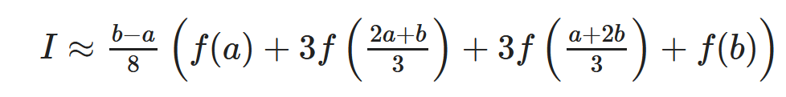
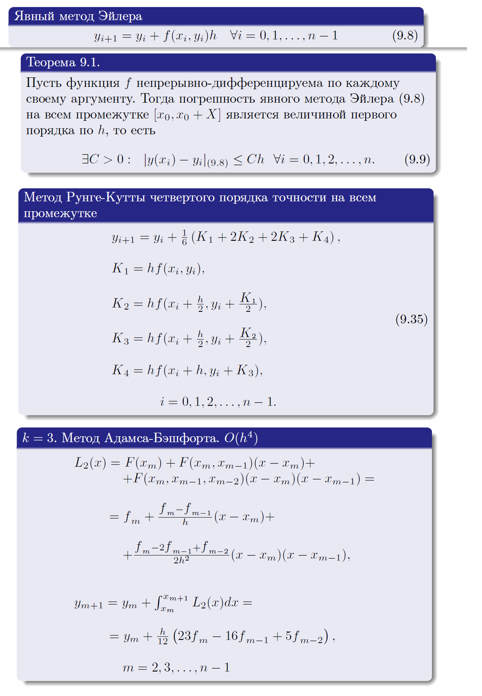

# Лабораторные по численным методам

## lab2 (Вариант 12)

### Обоснование выбора φ(x)


Все остальные обоснования представлены в выводе программы в коде.
```
Обоснование выбора отрезка: f(left)*f(right) < 0
-0.040691004125055164

Обоснование выбора x_0: f(x_0)*f''(x_0) > 0
0.5078771576555405

Метод половинного деления
Количество итераций: 13
Интервал (0.1680908203125, 0.16812744140625002)

Метод Ньютона
Количество итераций: 4
0.1681219754789549

Модифицированный метод Ньютона
Количество итераций: 6
0.16812475684379047

Метод неподвижных хорд
Количество итераций: 5
0.16811976205572976

Метод подвижных хорд
Количество итераций: 5
0.16812197548582009

Метод простой итерации
Количество итераций: 6
0.16812603886100677
```

Для каждого метода выводится количество итераций (к пункту о скорости сходимости методов).

## lab3 (Вариант 12)

### Условие


### Сравнение результатов метода Гаусса и метода Гаусса с выбором главного элемента
Получились следующие корни:
```
Метод Гаусса
[3.0000000000000004, 2.0000000000000004, 1.0000000000000002]

Метод Гаусса с выбором главного элемента
[2.9999999999999996, 2.0, 1.0]
```
У второго метода 2 корня получились более точно, чем у первого. 
Оба достаточно близко к реальному решению: (3, 2, 1)

### Cходимость метода Якоби (пункт 3)
Воспользуемся достаточным условием сходимости метода Якоби (теорема 4.7)

Из него видно, что в исходной матрице условие строгого диагонального преобладания
не выполняется для 3-й строчки: `0.5 + 0.32 = 0.82 > 0.16`. Поэтому нельзя быть
уверенными в том, что метод сойдётся. 

Поменяем 1 и 3 строчки местами. Теперь легко заметить, что условие выполняется
для всех строчек. Следовательно, метод будет сходиться для любого начального x.
```
0.32 + 0.16 = 0.48 < 0.5
0.24 + 0.1 = 0.34 < 0.88
0.2 + 0.08 = 0.28 < 1.62
```
### Cходимость метода Гаусса-Зейделя (пункт 4)

Рассуждения абсолютно аналогичны рассуждениям для метода Якоби.

### Сравнение количества итераций метода Якоби и метода Гаусса-Зейделя

```
Метод Якоби
Число итераций:  12
[2.999853346812849, 1.999992421725982, 1.0000016683831427]

Метод Гаусса-Зейделя
Число итераций:  8
[3.000042789918389, 1.9999856991515688, 0.9999940110792886]
```
Как видно из результатов, метод Гаусса-Зейделя сходится быстрее.


## lab4 (Вариант 12)

### Симпсон
Используемые формулы:


Считая интеграл по составной формуле Симпсона получаем следующие результаты
```
Симпсон для шага 0.1  0.9624235866388686
Симпсон для шага 0.05  0.9624236461575418
Симпсон для шага 0.025  0.9624236498716947
```

### 3/8
Формула для трёх восьмых


```
3/8 для шага 0.1: 0.9624236219118909
3/8 для шага 0.05: 0.9624236483585635
3/8 для шага 0.025: 0.962423650009203
```

### Оценка погрешности

```
Погрешность для Симпсона 0.1: -3.967911547479256e-09
Погрешность для Симпсона 0.05: -2.476101916097188e-10
Погрешность для Симпсона 0.025: -1.5469595974574683e-11

Погрешность для 3/8 0.1: -8.531184719236117e-10
Погрешность для 3/8 0.05: -5.3246435934241734e-11
Погрешность для 3/8 0.025: -3.3267367355495394e-12
```

### Квадратура Гаусса

Используемые формулы


Система для a1, a2, a3


Весь остальной вывод в коде

```
Квадратура Гаусса 0.9624950979240379
```

## lab5 (Вариант 12)

### Используемые формулы и их погрешности



* Погрешность явного метода Эйлера на всём промежутке является величиной первого порядка
* Метод Рунге-Кутты четвертого порядка имеет точность четвертого порядка на всем промежутке (кто бы мог подумать)
* Трехшаговый метод Адамса имеет порядок точности для шага четвертого порядка

### Графики


### Консольный вывод программы

```
N = 10
X [0, 0.1, 0.2, 0.30000000000000004, 0.4, 0.5, 0.6, 0.7, 0.7999999999999999, 0.8999999999999999, 0.9999999999999999]
Y Эйлера [0.5, 0.50625, 0.5127373168945313, 0.5194772375458333, 0.5264864556094347, 0.5337832416748417, 0.5413876391472193, 0.5493216905860512, 0.5576097002393406, 0.5662785397925139, 0.5753580059645769]
Y Рунге-Кутта [0.5, 0.5063696835302173, 0.512989176017083, 0.5198752448679461, 0.5270462766327639, 0.5345224837390339, 0.5423261444321416, 0.550481882414085, 0.5590169941839881, 0.5679618340052579, 0.5773502688857998]
Y Адамса [0.5, 0.5063696835302173, 0.512989176017083, 0.51987467768345, 0.5270450269610875, 0.5345204440328066, 0.5423231802462282, 0.5504778337154473, 0.5590116706888527, 0.5679550084023713, 0.5773416683699756]
Y Точного решения [0.5, 0.5063696835418333, 0.5129891760425771, 0.5198752449100363, 0.5270462766947299, 0.5345224838248488, 0.5423261445466404, 0.5504818825631803, 0.5590169943749475, 0.5679618342470648, 0.5773502691896258]

N = 20
X [0, 0.05, 0.1, 0.15000000000000002, 0.2, 0.25, 0.3, 0.35, 0.39999999999999997, 0.44999999999999996, 0.49999999999999994, 0.5499999999999999, 0.6, 0.65, 0.7000000000000001, 0.7500000000000001, 0.8000000000000002, 0.8500000000000002, 0.9000000000000002, 0.9500000000000003, 1.0000000000000002]
Y Эйлера [0.5, 0.503125, 0.506308960723877, 0.5095537526272895, 0.5128613300714242, 0.5162337362142242, 0.5196731082540348, 0.5231816830560236, 0.5267618031947885, 0.5304159234499704, 0.534146617795496, 0.5379565869273277, 0.5418486663793677, 0.5458258352825119, 0.5498912258278617, 0.5540481335018617, 0.5583000281687682, 0.5626505660844563, 0.5671036029353254, 0.5716632080071038, 0.576333679600891]
Y Рунге-Кутта [0.5, 0.503154605426298, 0.5063696835411436, 0.5096471914365426, 0.5129891760410643, 0.5163977794923399, 0.5198752449075404, 0.5234239225871562, 0.5270462766910579, 0.5307448924299305, 0.5345224838197672, 0.5383819020522763, 0.5423261445398655, 0.546358364700406, 0.5504818825543656, 0.5547001962152407, 0.5590169943636676, 0.5634361698063091, 0.567961834232795, 0.5725983342978682, 0.5773502691717143]
Y Адамса [0.5, 0.503154605426298, 0.5063696835411436, 0.5096471588428622, 0.5129891077024139, 0.5163976728106057, 0.5198750968344815, 0.5234237298087318, 0.527046035614471, 0.5307445991551266, 0.5345221341092473, 0.5383814912976647, 0.5423256677246621, 0.5463578163584392, 0.5504812567233796, 0.5546994863849689, 0.5590161934176437, 0.5634352699565548, 0.5679608269463874, 0.5725972102142344, 0.5773490180093136]
Y Точного решения [0.5, 0.5031546054266276, 0.5063696835418333, 0.5096471914376255, 0.5129891760425771, 0.5163977794943222, 0.5198752449100363, 0.5234239225902136, 0.5270462766947299, 0.5307448924342753, 0.5345224838248488, 0.5383819020581655, 0.5423261445466404, 0.546358364708153, 0.5504818825631803, 0.5547001962252291, 0.5590169943749475, 0.563436169819011, 0.5679618342470649, 0.5725983343138682, 0.5773502691896258]

N = 30
X [0, 0.03333333333333333, 0.06666666666666667, 0.1, 0.13333333333333333, 0.16666666666666666, 0.19999999999999998, 0.2333333333333333, 0.26666666666666666, 0.3, 0.3333333333333333, 0.36666666666666664, 0.39999999999999997, 0.4333333333333333, 0.4666666666666666, 0.49999999999999994, 0.5333333333333333, 0.5666666666666667, 0.6, 0.6333333333333333, 0.6666666666666666, 0.7, 0.7333333333333333, 0.7666666666666666, 0.7999999999999999, 0.8333333333333333, 0.8666666666666666, 0.8999999999999999, 0.9333333333333332, 0.9666666666666666, 0.9999999999999999]
Y Эйлера [0.5, 0.5020833333333333, 0.5041928169909818, 0.5063290012580358, 0.5084924527387861, 0.5106837549833686, 0.5129035091440375, 0.5151523346627328, 0.5174308699917218, 0.5197397733492078, 0.5220797235119278, 0.5244514206468948, 0.5268555871845901, 0.5292929687360636, 0.5317643350565743, 0.5342704810585853, 0.5368122278771243, 0.5393904239907361, 0.5420059464014845, 0.5446597018777103, 0.5473526282635248, 0.5500856958593093, 0.5528599088778124, 0.5556763069807797, 0.558535966901427, 0.5614400041584764, 0.5643895748679169, 0.5673858776591354, 0.5704301557025904, 0.5735236988567725, 0.5766678459428267]
Y Рунге-Кутта [0.5, 0.5020964452533918, 0.5042194840895242, 0.5063696835416995, 0.5085476277154239, 0.5107539184550122, 0.5129891760422837, 0.5152540399291915, 0.5175491695063491, 0.5198752449095525, 0.5222329678665383, 0.5246230625863707, 0.5270462766940184, 0.5295033822128589, 0.5319951765980436, 0.5345224838238644, 0.5370861555284877, 0.5396870722196698, 0.5423261445453283, 0.5450043146331343, 0.5477225575035993, 0.5504818825614737, 0.5532833351706327, 0.5561279983180345, 0.5590169943727643, 0.561951486946653, 0.5649326828634764, 0.567961834244304, 0.5710402407171808, 0.5741692517600007, 0.5773502691861617]
Y Адамса [0.5, 0.5020964452533918, 0.5042194840895242, 0.50636967727776, 0.5085476147902567, 0.5107538985542475, 0.5129891488037103, 0.5152540049700857, 0.5175491264232861, 0.5198751932769813, 0.5222329072353961, 0.5246229924826076, 0.5270461966170155, 0.5295032916337321, 0.5319950749578242, 0.5345223705315447, 0.5370860299589229, 0.5396869337113217, 0.5423259923978387, 0.5450041481047132, 0.5477223758082121, 0.5504816848658086, 0.5532831205908308, 0.5561277659161603, 0.5590167431529929, 0.5619512158511488, 0.5649323907679353, 0.5679615199531266, 0.5710399029582434, 0.574168889178984, 0.5773498803403977]
Y Точного решения [0.5, 0.5020964452534338, 0.5042194840896108, 0.5063696835418333, 0.5085476277156078, 0.5107539184552492, 0.5129891760425771, 0.5152540399295447, 0.5175491695067657, 0.5198752449100363, 0.5222329678670935, 0.5246230625870018, 0.5270462766947299, 0.5295033822136559, 0.5319951765989315, 0.5345224838248488, 0.5370861555295746, 0.5396870722208659, 0.5423261445466404, 0.5450043146345697, 0.5477225575051661, 0.5504818825631803, 0.5532833351724882, 0.5561279983200486, 0.5590169943749475, 0.5619514869490164, 0.564932682866032, 0.5679618342470648, 0.5710402407201608, 0.5741692517632145, 0.5773502691896258]
```

### Сравнение методов

